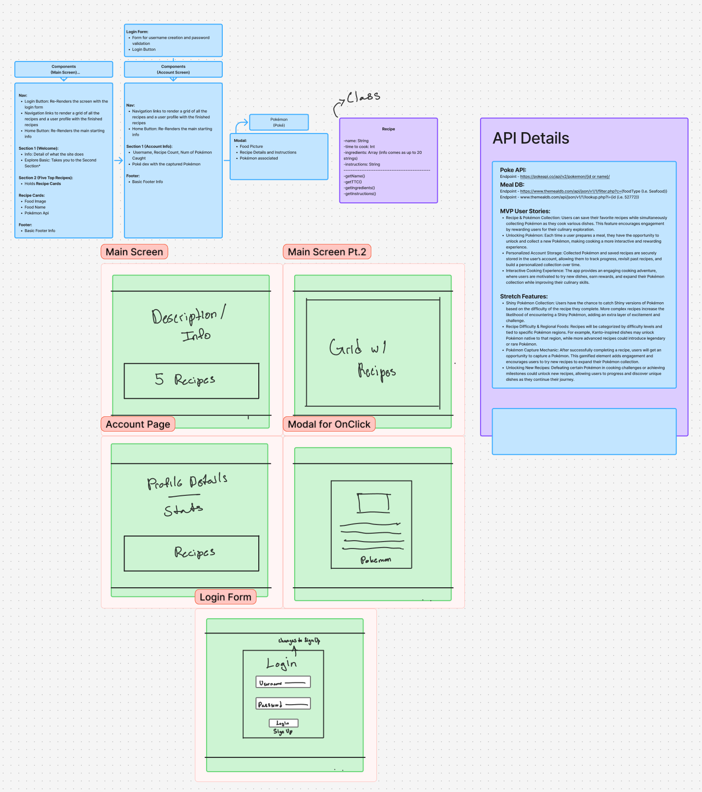

# PokeBowls

Created by Ibrahim Hudson

## 🚀 Mission statement

Our application, Poke Bowls is for people who like to cook. It allows users to find new recipes while catching their favorite pokemon.

## API & React Router

This application will use the Meal DB API (Primary) and the Pokemon API (Secondary). Below are the documentation and specific endpoints we intend to use and the front-end pages that will use them.

- Link to API documentation #1: https://pokeapi.co/docs/v2#pokemon

  - API endpoint #1 : https://pokeapi.co/api/v2/pokemon/{ID}

    - Returns the data tied to a specific pokemon
    - [`name`, `id`, `sprites`, `types`]

- Link to API documentation #2: https://www.themealdb.com/api.php

  - API endpoint #1 : https://www.themealdb.com/api/json/v1/1/lookup.php?i={ID}

    - Used to get the full data of a recipe
    - [`strMeal`, `strCategory`, `strArea`, `strArea`, `strInstructions`, `strMealThumb`, `strTags`,`strYoutube`, `ingredients`, `measurements`]

  - API endpoint #2 : https://www.themealdb.com/api/json/v1/1/categories.php

    - Lets you access food by a list of categories i.e. Beef, Chicken, Side, Dessert, etc.
    - [`strCategory`, `strCategoryDescription`]

  - API endpoint #3 : https://www.themealdb.com/api/json/v1/1/filter.php?c={Category}
    - Used to get a list of foods under the provided Category
    - [`idMeal`, `strName`, `strMealThumb`]

## 👩‍💻 MVP User Stories & Frontend Routes

The application will feature the following frontend routes and core features:

- Recipe & Pokémon Collection (Main Page): Users can save their favorite recipes while simultaneously collecting Pokémon as they cook various dishes. This feature encourages engagement by rewarding users for their culinary exploration.
- Unlocking Pokémon (Main Page): Each time a user prepares a meal, they have the opportunity to unlock and collect a new Pokémon, making cooking a more interactive and rewarding experience.
- Personalized Account Storage (Account Page): Collected Pokémon and saved recipes are securely stored in the user’s account, allowing them to track progress, revisit past recipes, and build a personalized collection over time.

## 🤔 Stretch User Stories

If time permits, the following stretch features will be implemented in order of priority:

- Interactive Cooking Experience: The app provides an engaging cooking adventure, where users are motivated to try new dishes, earn rewards, and expand their Pokémon collection while improving their culinary skills.
- Shiny Pokémon Collection: Users have the chance to catch Shiny versions of Pokémon based on the difficulty of the recipe they complete. More complex recipes increase the likelihood of encountering a Shiny Pokémon, adding an extra layer of excitement and challenge.
- Recipe Difficulty & Regional Foods: Recipes will be categorized by difficulty levels and tied to specific Pokémon regions. For example, Kanto-inspired dishes may unlock Pokémon native to that region, while more advanced recipes could introduce legendary or rare Pokémon.
- Pokémon Capture Mechanic: After successfully completing a recipe, users will get an opportunity to capture a Pokémon. This gamified element adds engagement and encourages users to try new recipes to expand their Pokémon collection.
- Unlocking New Recipes: Defeating certain Pokémon in cooking challenges or achieving milestones could unlock new recipes, allowing users to progress and discover unique dishes as they continue their journey.

## 📆 Timeline for reaching MVP in 1 week

To ensure that we can complete all core features of the application in 1 week, we will aim to complete tasks according to the following timeline:

**Day 1 | 3/15 11:59pm**

- [ ] Nav Bar Finished
- [ ] Footer Finished
- [ ] Local Storage

**Day 2 | 3/16 11:59pm**

- [ ] Recipe Class Setup
- [ ] API Fetching Fetching and Data Setup
- [ ] Login Form
- [ ] Recipe Cards
- [ ] Recipe Modal

**Day 3 3/17 11:59pm** (MVP due by the end of the day)

- [ ] Account Page, Load Saved Recipes
- [ ] Account Page, Attach Pokemon
- [ ] Account Page, Data Loads Correctly

**Day 4 | 3/18 11:59pm**

- [ ] CSS Styling for Main Page is polished
- [ ] CSS Styling for Account Page is polished
- [ ] CSS Styling for Login Page is polished
- [ ] CSS Styling for Modal Page is polished

**Day 5 | 3/19 11:59pm**

- [ ] Bug fixes
- [ ] any Overflow aka overdue check points

## Wireframes of each page in your application

Below, you can find wireframes for my project:

